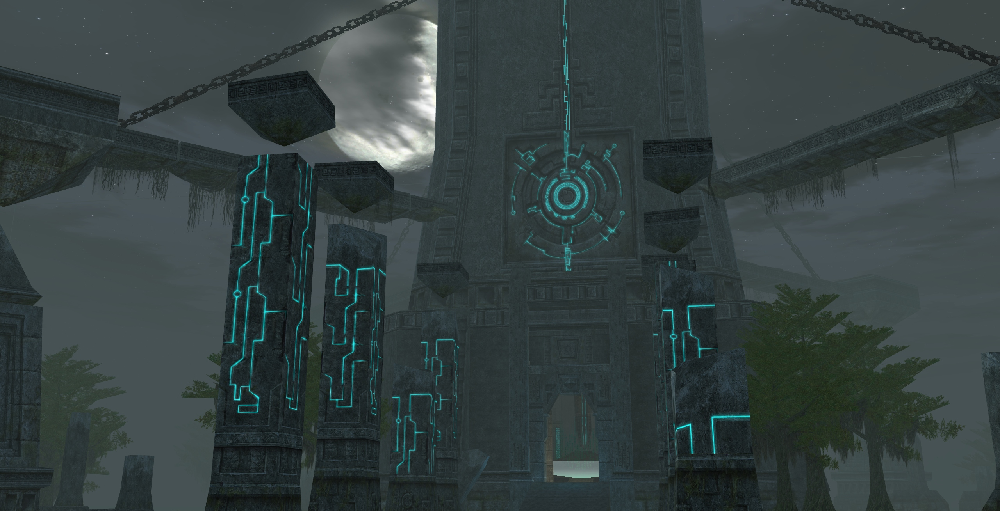
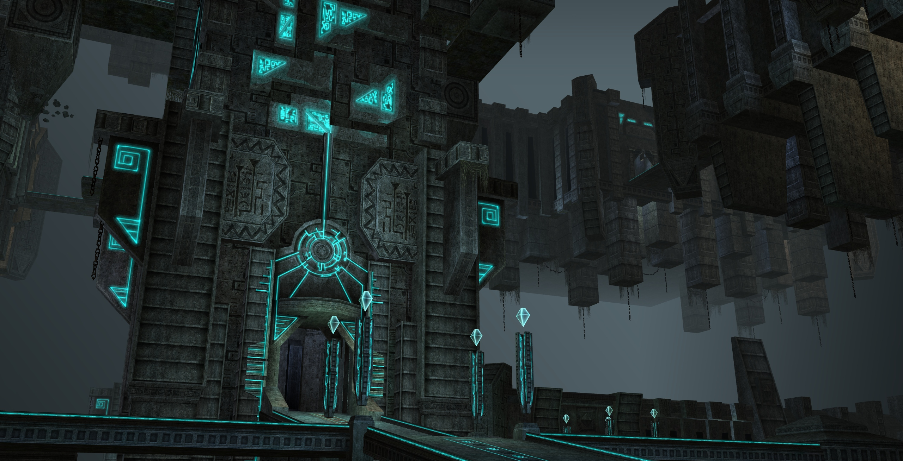
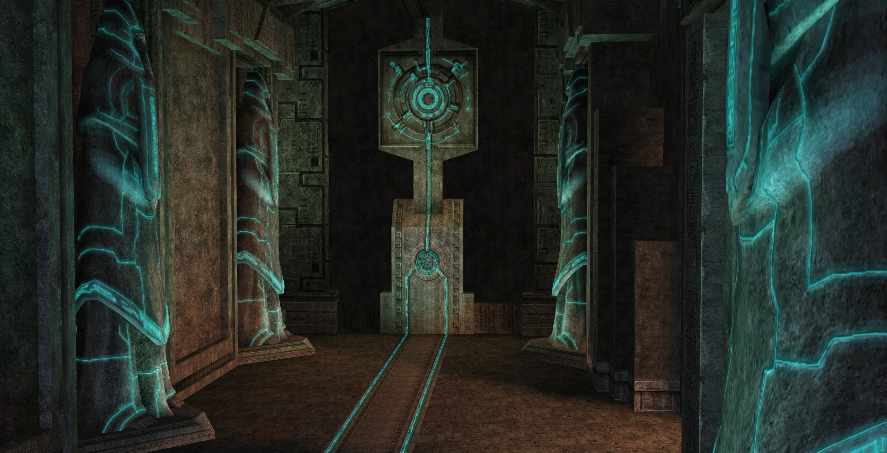

# A Lineage II Chronicle ~~3: Rise of Darkness~~ 4: Scions of Destiny client emulator for the browser

_At least it might be someday, hopefully._

## Why?
Modern Lineage II is a _mostly_ dead game full of bots and bad decisions made by NCSOFT. Even their attempts to provide a supposedly classical experience is filled with microtransactions, gameplay elements that prevent any type of punishment or even ban you from using chat until you reach a certain levels, these might have changed since the last time I played but it made me sad enough to just quit.

Private servers are also a soulless mess that die within a week after inception, have insane rates, can't decide decide if it's C6 or Interlude and generally outright refuse to run something older than Interlude.

This is an attempt to preserve an old game me and my friends used to love by porting, or at least attempting to, it to TypeScript so that it could even potentially run in the browser. This is not only an attempt to create an open-source interoperable client to preserve the game for the future but is also a way to allow more modding capabilities than were previously even possible by the limited toolsets that came out over more than a decade of the game lifespan.

## How?
This is the hard part. Re-creating a game client even if I had the original source code would already be a gradiose task, now imagine all I have is encrypted asset binaries. There exist some open source tools like _UEViewer_ that has greatly helped me to understand the binary layout, some things come directly from _UE4_ source code, although this is not as useful because a lot of _UE2_ things no longer exist in it. And then there's disassembly, it's slow and painful but it does the job.

I'm not a vanilla purist so if there's some data that's not critical but is hiding there in the binary, I will just skip it if it's possible to do without it.

## When?
Hopefully someday it's actually complete, obviously this is a passion project and it's not sustainable to invest any reasonable amount of time to it, so there can be months before even a small amount of progress is made, depending on my schedule. However, any help is always welcome, I will not however take bug reports or requests because obviously it's not something that's even remotely ready to be used.

## What's on the timeline?
Current stable release resolved a lot of parity issues with sounds, emitters. Added some missing entities like deco layers for terrain and animating objects like gandolas, castle doors, windmills, etc. Fixed seven signs moons and a few performance upgrades. But the major issue that's been plagueing me that has been resolved is the erradication of the coordinate swizzling, all assets are now in UE2 format, although it required duct-typing three which while I don't particularly enjoy had to be done for this to work. Additionally, one major feature that has been added - progressive sector loading/unloading. No more running out of alloted RAM and having browser kill your tab. It's not perfect and can be improved but it's probably fine for gameplay as there's still some minor stutter when scene first loads in. I reduced it as much as possible by having the geometry be prioritized for loading and then loading in materials and lighting information in progressively to reduce sync stutter as much as possible but I'm contempt with how it is now.

## The code is messy!
I know, originally I thought I wanted to make it clean, hence why it's using TypeScript in the first place. But I quickly realized that it needs *WAY* too many changes when trying to find memory layouts, etc. If I ever reach the stage where I can actually start working on the gameplay emulation and it won't be just a glorious asset viewer, I will clean it up beforehand.

## Where are the assets? I want to see what's been done.
I don't know of the legality of providing assets, technically it wouldn't be piracy since the client itself was always free, but you'll have to locate, download and install the client. After which, just symlink it to the root project directory under `assets/`. The `stable` branch should functioning. Here are some previews:

## Why switch to C4?

This was actually a switch that was done couple years ago but I never updated the readme. It was mostly done because at the time it was easier to find a functioning client & L2J server combo. While it may not be permanent change, there are some codebase changes between C3 & C4 that are not fully compatibly although MOST of the stuff in C4 is forwards compatible to C3 so I may eventually switch back to C3 or support both.