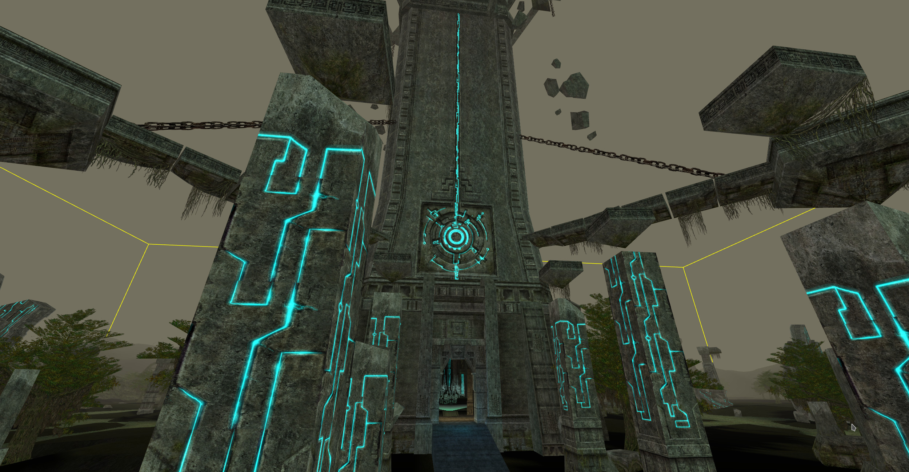
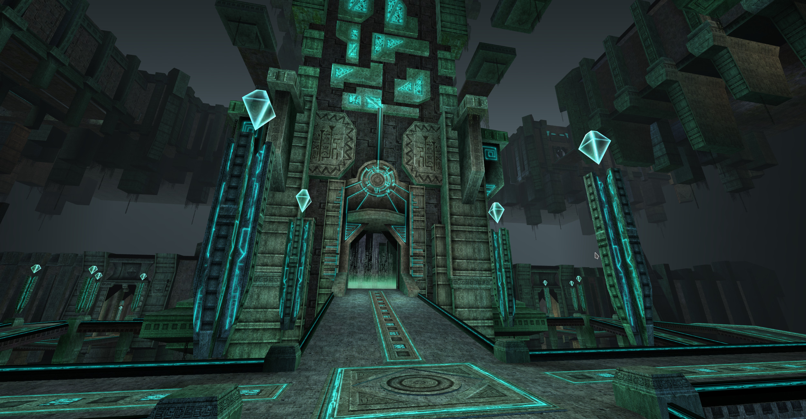

# A Lineage II Chronicle 3: Rise of Darkness client emulator for the browser
_At least it might be someday, hopefully._

## Why?
Modern Lineage II is mostly a _mostly_ dead game full of bots and bad decisions made by NCSOFT. Even their attempts to provide a supposedly classical experience is filled with microtransactions, gameplay elements that prevent any type of punishment or even ban you from using chat until you reach a certain levels, these might have changed since the last time I played but it made me sad enough to just quit.

Private servers also a soulless mess that die a week after inception, have insane rates, can't decide decide if it's C6 or Interlute and generally outright refuse to run something older than Interlude.

This is an attempt to preserve an old game me and my friends used to love by porting, or at least attempting to, it to TypeScript so that it could even potentially run in the browser. This is not only an attempt to create an open-source interoperable client to preserve the game for the future but is also a way to allow more modding capabilities than were previously even possible by the limited toolsets that came out over more than a decade of the game lifespan.

## How?
This is the hard part. Re-creating a game client even if I had the original source code would already be a gradiose task, now imagine all I have is encrypted asset binaries. There exist some open source tools like _UEViewer_ that has greatly helped me to understand the binary layout, some things come directly from _UE4_ source code, although this is not as useful because a lot of older things are not existing in the _UE2_ version Lineage2 uses. And then there's disassembly, it's slow and painful but it does the job.

I'm not a vanilla purist so if there's some data that's not critical but is hiding there in the binary, I will just skip it if it's possible to do without it.

## When?
Hopefully someday it's actually complete, obviously this is a passion project and it's not sustainable to invest any reasonable amount of time to it, so there can be months before even a small amount of progress is made, depending on my schedule. However, any help is always welcome, I will not however take bug reports or requests because obviously it's not something that's even remotely ready to be used.

## What's on the timeline?
Currently I am working on locating the lightmaps for static meshes, I've seen them in raw dumps using GIMP so I know they are there, just need to find the appropriate datastructures that store them and their offsets, terrain lightmaps have been located. Next up would likely be collision.

## The code is messy!
I know, originally I thought I wanted to make it clean, hence why it's using TypeScript in the first place. But I quickly realized that it needs *WAY* too many changes when trying to find memory layouts, etc. If I ever reach the stage where I can actually start working on the gameplay emulation and it won't be just a glorious asset viewer, I will clean it up beforehand.

## Where are the assets? I want to see what's been done.
I don't know of the legality of providing assets, technically it wouldn't be piracy since the client itself was always free, but you'll have to locate, download and install the client. After which, just symlink it to the root project directory under `assets/`. The `stable` branch should functioning. Here are some previews:

